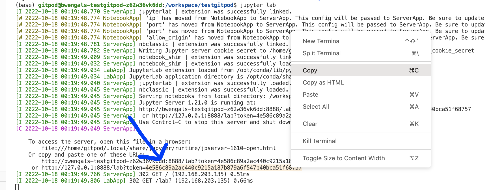

# Test Gitpod

1. Click this button 
2. Whatever IDE you choose, you should have a terminal somewhere (I did browser VS Code).  Type `jupyter lab` into the terminal and hit enter.
3. Jupyter lab will open in a new browser tab and ask for the token.  Go back to the Gitpod tab and see the token (see screenshot).  Copy it and then paste it into the Jupyter lab tab.
4. Done 

